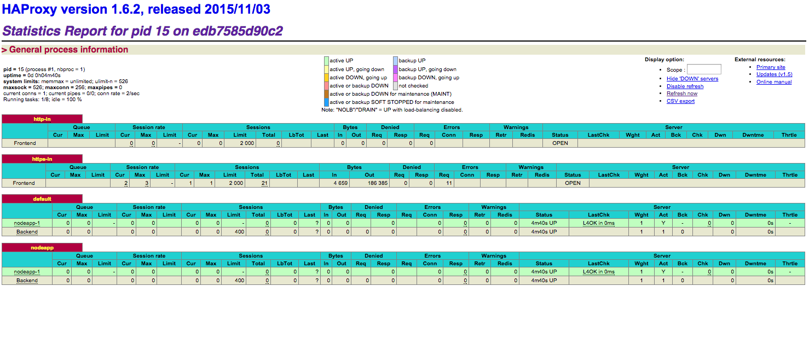

## Running HAproxy on CoreOS cluster with confd (etcd backend)

* Here is the [Dockerfile](https://github.com/xuwang/coreos-docker-dev/tree/master/apps/haproxy-supervisor/docker) based from Dockerhub official haproxy. 
* We use Confd to manage upstream service/server changes
* Haproxy runs under supervisor. Confd reloads haproxy using _supervisorctl restart haproxy_.
* The restart script [haproxy-iptable-wrappers.sh](https://github.com/xuwang/coreos-docker-dev/blob/master/apps/haproxy-supervisor/docker/haproxy-iptable-wrapper.sh) utilizes itpable to minimize downtime [True Zero Downtime HAProxy Reloads](http://engineeringblog.yelp.com/2015/04/true-zero-downtime-haproxy-reloads.html).
* Run on CoreOS environment, but should work in any etcd/sytemd/docker supported environment.
  
## Quick start 

1. Checkout the Vagrant CoreOS box

    ```
    git clone https://github.com/xuwang/coreos-docker-dev
    ```

  By default, this stands up a cluster with one node with etcd2. You can modifiy Vagrant file to fire up more machines. See README for more inforamtion on this repo.

2. Make sure skydns up and running

    ```
    vagrant ssh
    Last login: Mon Dec 14 18:59:17 2015 from 10.0.2.2
    CoreOS beta (877.1.0)
    core@n1 ~ $ etcdctl ls --recursive /skydns/
    /skydns/local
    /skydns/local/docker
    /skydns/local/docker/registry
    /skydns/local/docker/dns
    /skydns/local/docker/dns/ns
    /skydns/local/docker/dns/ns/xfb53f08ee90c48f0b5aefa55848a9c41
    /skydns/local/docker/n1
    /skydns/config
    ```

  The default domain is _docker.local_. You should be able to ping n1.docker.local.  

3. Start confd and a backend nodeapp server (or more if you have more machines in the cluster)

  Now you have a cluster up and running. Let's start confd, haproxy, and an applicaiton backend server.

    ```
    $ cd /var/lib/apps/haproxy-supervisor/nodeapp-backend/units
    fleetctl start nodeapp@1.service
    $ cd /var/lib/apps/confd/units
    fleetctl start confd@1.service
    $ cd  /var/lib/apps/haproxy-supervisor/units
    fleetctl start haproxy@1.service
    ```

## What's happenning 

1. Nodeapp@1.service registered with etcd2 during start up

    ```
    $ etcdctl ls --recursive  /haproxy-discover/
    /haproxy-discover/http-services
    /haproxy-discover/http-services/default
    /haproxy-discover/http-services/default/domain
    /haproxy-discover/http-services/default/upstreams
    /haproxy-discover/http-services/default/upstreams/nodeapp-1
    /haproxy-discover/http-services/nodeapp
    /haproxy-discover/http-services/nodeapp/domain
    /haproxy-discover/http-services/nodeapp/upstreams
    /haproxy-discover/http-services/nodeapp/upstreams/nodeapp-1
    /haproxy-discover/tcp-services
    ```

2. Fleet units

    ```
    $ fleet list-units
    UNIT			MACHINE				ACTIVE		SUB
    confd@1.service		fb53f08e.../172.17.8.101	active		running
    haproxy@1.service	fb53f08e.../172.17.8.101	active	    running
    nodeapp@1.service	fb53f08e.../172.17.8.101	active		running
    ```

3. Confd noticied the change and generated haproxy.cfg based on haproxy template (see /var/lib/apps/confd/templates)

    ```
    $  more /var/lib/apps-data/haproxy/haproxy.cfg
    global
        log /dev/log  local0
        log /dev/log  local1 notice
        pidfile /var/run/haproxy.pid
        maxconn 256
        tune.ssl.default-dh-param 2048
        ssl-server-verify none
        server-state-base /var/lib/haproxy/states

    defaults
        mode   http
        balance roundrobin
        # make sure log-format is on a single line
        log-format {"type":"haproxy","timestamp":%Ts,"http_status":%ST,"http_request":"%r","remote_addr":"%ci","bytes_read":%B,"upstream_addr":"%si","backend_n
    ame":"%b","retries":%rc,"bytes_uploaded":%U,"upstream_response_time":"%Tr","upstream_connect_time":"%Tc","session_duration":"%Tt","termination_state":"%ts"
    }

    ...

    frontend http-in
        bind *:80
        http-request set-header X-Forwarded-Port %[dst_port]
        reqadd X-Forwarded-Proto:\ http
    
    ...

    frontend https-in
        bind *:443 ssl crt /etc/ssl/private
        reqadd X-Forwarded-Proto:\ https
        option http-server-close
    ...

    backend nodeapp
        server nodeapp-1 172.17.8.101:8000 check
    
    backend default
         server nodeapp-1 172.17.8.101:8000 check
    ```

  The generated haproxy.cfg does SSL-termination. For applications that need SSL pass-through, you can set a flag when register the app. See nodeapp unit for details.

## Test 

* Edit /etc/hosts

  Since we are running a Vagrant CoreOS box, to make it easier to access the server on the host, let's put container IP in /etc/hosts on the host machine.
 
 ```
  $ ping n1.docker.local
  PING n1.docker.local (172.17.8.101) 56(84) bytes of data.
  ...
  ```
  On another terminal that's outside of your Vagrant box, edit host's /etc/hosts file so it looks like:

  ```
  172.17.8.101 haproxy.docker.local
  172.17.8.101 nodeapp.docker.local
  172.17.8.101 default.docker.local
  ```

* Access the server behind HAProxy, head to https://nodeapp.docker.local:8443/

* Point your browser to https://haproxy.docker.local:8443/admin?stats. The login name is _admin_, the password is _helloworld_.



